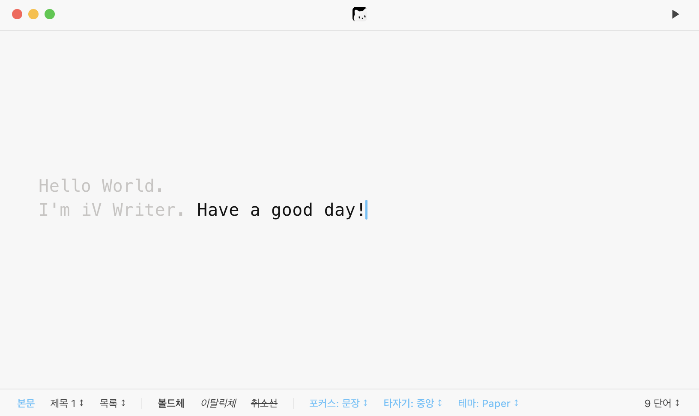

  

<h1 align="center">iV Writer</h1>

  <em>A distraction-free markdown editor for VS Code offering iA Writer-style typography and an immersive writing experience.</em>

  
  

  <b>English</b> | <a href="README.md">한국어</a>

  

---

## ✨ Features

- **Focus Mode**: Keeps only the current sentence or paragraph sharply visible while softly dimming the surrounding text. (`Cmd + /` / `Ctrl + /`)
- **Typewriter Center Lock**: Anchors the cursor stably at the vertical center of the screen for comfortable writing without eye fatigue.
- **Outdented Headings**: Heading markers (`#`, `##`, etc.) are placed in the left margin gutter so all body text aligns vertically in a clean line.
- **Smart Auto-Hide HUD**: Top and bottom toolbars automatically fade away while typing to eliminate distractions, reappearing upon scrolling or hovering.
- **Formatting Bar**: Easily format Paragraph, Headings (H1~H6), Lists (Bulleted, Numbered, Task list), Bold, Italic, and Strikethrough with quick mouse actions.
- **Markdown Preview**: Instantly preview rendered markdown output by clicking the top-right play button or pressing `Cmd + Shift + V` (`Ctrl + Shift + V`).
- **4 Writing Themes**:
  - 📄 **Paper**: Warm linen paper aesthetic (Default)
  - 🌙 **Dark**: Calming dark mode for reduced eye strain
  - 📜 **Sepia**: Vintage typewriter classic sepia
  - 🌌 **Midnight**: Deep navy aesthetic for late-night writing
- **Seamless CJK / IME Support**: Smooth composition without character glitching or cursor jumps during fast Korean/CJK typing.
- **Daily Notes**: Automatically create or open today's markdown daily note with `Cmd + Shift + D` (`Ctrl + Shift + D`).

---

## ⌨️ Shortcuts

| Shortcut (macOS)    | Shortcut (Windows/Linux) | Action                                          |
| :------------------ | :----------------------- | :---------------------------------------------- |
| `Cmd + Shift + W`   | `Ctrl + Shift + W`       | Open in iV Writer Editor                        |
| `Cmd + Shift + V`   | `Ctrl + Shift + V`       | Toggle Markdown Preview                         |
| `Cmd + /`           | `Ctrl + /`               | Cycle Focus Mode (Sentence ➡️ Paragraph ➡️ Off) |
| `Cmd + Shift + D`   | `Ctrl + Shift + D`       | Create / Open Today's Daily Note                |
| `Cmd + F`           | `Ctrl + F`               | Open Integrated Search & Replace Panel          |

---

## 🖥️ Interface & Controls

- **Top-Left Traffic Light Buttons**:
  - 🔴 **Red**: Close iV Writer and switch to the default VS Code text editor
  - 🟡 **Yellow**: Close current editor tab
  - 🟢 **Green**: Toggle iV Writer Zen / Fullscreen mode
- **Top-Right Button**:
  - `▶` / `✏️`: Toggle Markdown Preview / Edit mode
- **Bottom Formatting Bar**:
  - `[Paragraph]`: Switch to standard body text
  - `[Heading 1 ↕]`: Heading level selector (H1–H6)
  - `[List ↕]`: List format selector (Bulleted, Numbered, Checklist)
  - Quick toggles for Focus mode, Typewriter lock, Theme preset, and Word count statistics

---

## 📄 License

MIT License
